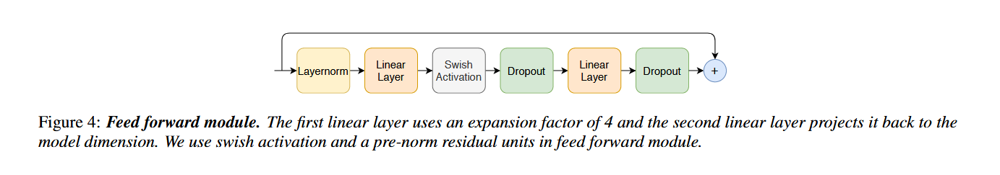
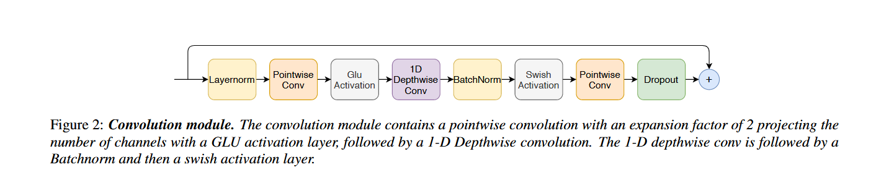

# gpt

## Conformer

### MultiheadAttention

相比于传统的MultiheadAttention，加入了一个线性层linear_out用来保证context的输出维度与之后进行残差连接的维度相同

确保多头注意力的输出维度与输入维度一致，满足后续残差连接(`output = attn_output + input`）的要求。(这里做了简化，MultiheadAttention的输出维度不一定为num_features,这里简化为num_features，因此出现`linear_out=torch.linear(num_features,num_features`的迷惑操作))

加入了cache，由每一次计算的k和v concat形成，在进行新一次attention计算的时候，将cache切分出来，attention可以以增量的形式实时提高上下文的内容。

因为加入了cache，导致绝对位置编码失效，采用相对位置编码(这里使用一个可训练的参数将绝对位置偏移映射为一个相对位置偏移)，同时引入两个偏置参数u和v分别代表q对于内容的偏移和q对于位置的偏移

标准Transformer注意力分数：
$$
\begin{align}
A_{i,j}^{abs}& =(W_qE_{x_i}+U_i)^T(W_kE_{x_j}+U_j)\\
&= E_{x_i}^\top W_q^\top W_k E_{x_j} + E_{x_i}^\top W_q^\top W_k U_j + U_i^\top W_q^\top W_k E_{x_j} + U_i^\top W_q^\top W_k U_j
\end{align}
$$
加入了相对位置偏移的Transformer注意力分数：(q对于内容偏置形成的项与k相乘，q对于位置偏置形成的项与相对位置编码相乘)
$$
\begin{align}
A_{i,j}^{rel} 
&= (W_q E_{x_i} + u)^T (W_{k,E} E_{x_j}) + (W_q E_{x_i} + v)^T (W_{k,R} R_{i-j}) \\
&= E_{x_i}^\top W_q^\top W_{k,E} E_{x_j} 
  + u^\top W_{k,E} E_{x_j} 
  + E_{x_i}^\top W_q^\top W_{k,R} R_{i-j} 
  + v^\top W_{k,R} R_{i-j}
\end{align}
$$

### PositionalEmbedding

这一层与传统的PositionalEmbedding差别不大，由于需要使用相对位置编码，不需要x+pos_emb,而需要输出x和pos_emb，pos_emb需要再Attention中进行相对位置编码，然后再进行计算

### Subsampling

实现了各种各样的下采样方法

## ConformerEncoder

### FeedForward Module

### Convoluation Module

